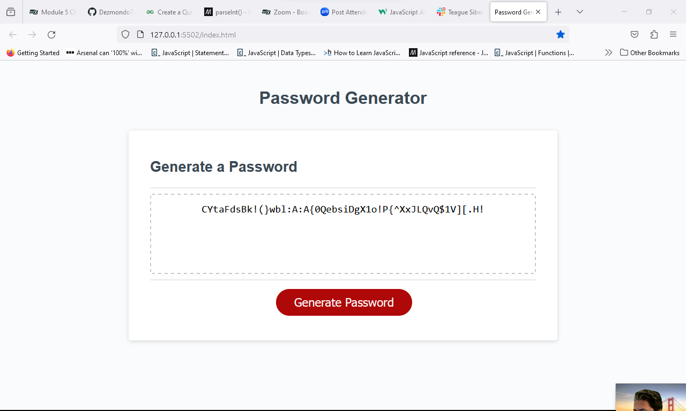

# Generation_Game

## This project is to create a random password generator using JavaScript

The project aim was to ask questions to the user to generate a Random Password. 

The criteria to create the password is below

length of password
Special Characters
Uppercase Characters
Lowercase chracters
Numeric Characters

Once the user has input all of data a Random Password is generated. 

The link to the URL is here https://dezmondo7.github.io/generation_Game/ 
Below is the final version of the completed version.

